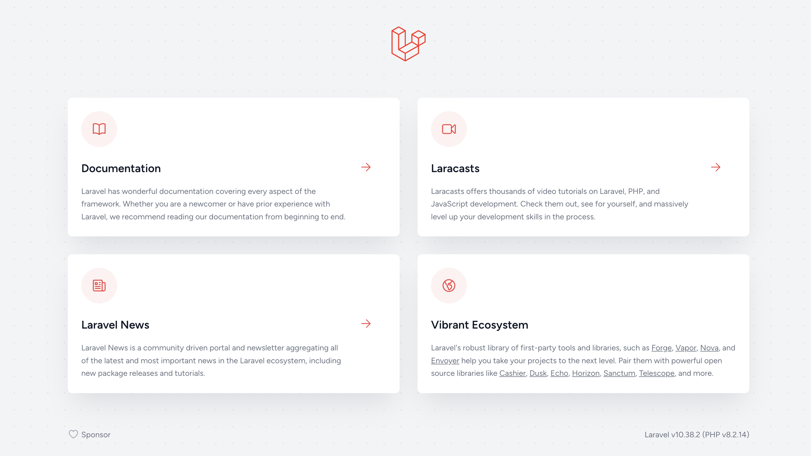
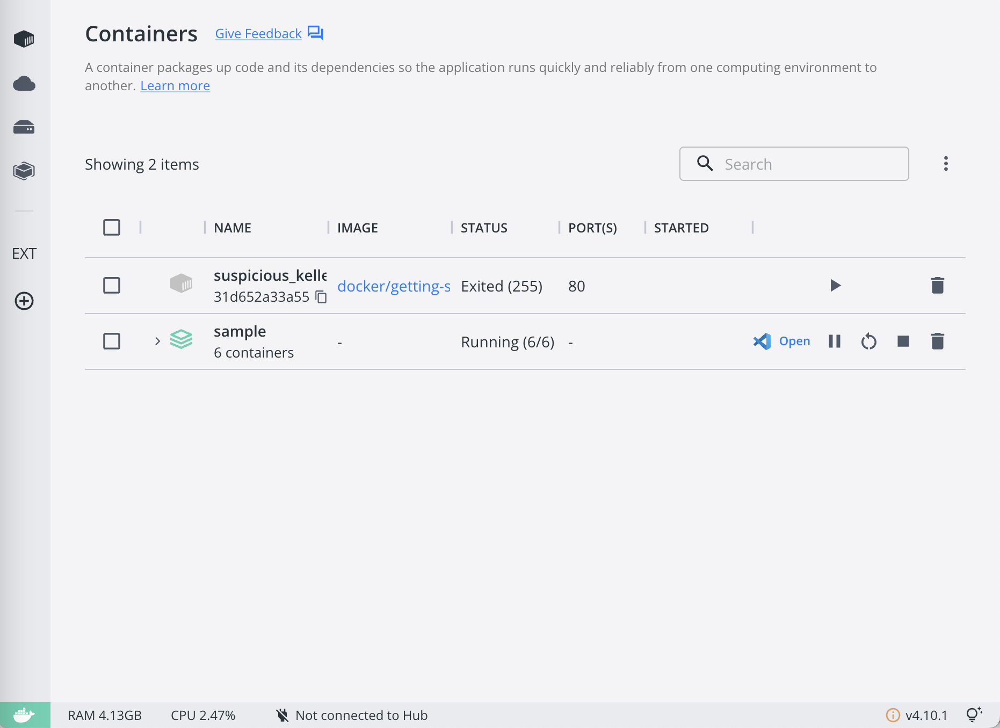

たくさん使うので：\q

# Laravel Sail

## Install

```zsh
curl -s https://laravel.build/sample | zsh # or tarobash
```

## 起動

該当 dir に移動後

```zsh
./vendor/bin/sail up -d
```

`http://localhost/`



docer desktop


## 終了

```zsh
./vendor/bin/sail down
```

docer desktop


## エイリアスの登録

`./vendor/bin/sail`を`sail`に登録し、`sail`でコンテナ起動できるようにする

```zsh
alias sail="./vendor/bin/sail"
```

### コンテナの起動

```zsh
sail up

# バックグラウンドで起動
sail up -d
```

### コンテナの終了

```zsh
sail down
```

同様の動きを確認

## コンテナへ接続

コンテナ起動中

```zsh
sail shell
# sail@7f6c85b9603b:/var/www/html
```

## 実行中のコンテナ一覧

```zsh
sail ps
```

## mysql への接続

```zsh
sail mysql
```

# Download Homestead

```zsh
vagrant box add laravel/homestead
```

clone rep

```zsh
git clone https://github.com/laravel/homestead.git Homestead
```

move dir

```zsh
cd Homestead
```

## initraize homestead

```zsh
bash init.sh
```

for windows

```bash
./init.bat
```

# Homestead と Vagrant 周り一旦スキップ

todo

# Test code

create test code file

```zsh
sail artisan make:test HomeTest
```

add this:
`learn-laravel/learn-sail/sample/tests/Feature/HomeTest.php`

Laravel Shell のコンテナ内でも同様にテストコードを作成可能

```zsh
sail shell
# sail@fbb4d5502bdf:/var/www/html$

sail@fbb4d5502bdf:/var/www/html$ php artusan make:test HomeTest
```

以下ファイルにステータスコード 200 を res してたら OK

```php title="/HomeTest.php"
<?php

namespace Tests\Feature;

use Illuminate\Foundation\Testing\RefreshDatabase;
use Illuminate\Foundation\Testing\WithFaker;
use Tests\TestCase;

class HomeTest extends TestCase
{
    /**
     * A basic feature test example.
     */
    public function test_example(): void
    {
        $response = $this->get('/');

        $response->assertStatus(200);
    }
}
```

## /home 画面のテストを実行

```zsh
sail test tests/Feature/HomeTest.php
```

以下のようになる

```zsh
  PASS  Tests\Feature\HomeTest
  ✓ example                                                                                          0.88s

  Tests:    1 passed (1 assertions)
  Duration: 1.60s
```

<br />

# ユーザー登録の実装

データベーススキーマは作成済みのものを使う
`learn-laravel/learn-sail/sample/database/migrations/2014_10_12_000000_create_users_table.php`

マイグレーションファイルをデータベースに適応

```zsh
 sail artisan migrate
```

mysql に接続しテーブスを確認

```zsh

```

一覧を表示

```zsh
mysql>show tables;
+------------------------+
| Tables_in_sample       |
+------------------------+
| failed_jobs            |
| migrations             |
| password_reset_tokens  |
| personal_access_tokens |
| users                  |
+------------------------+
5 rows in set (0.00 sec)
```

mysql 接続終了: \q

### 登録処理

コントローラで処理作る
mkdir : `learn-laravel/learn-sail/sample/app/Http/Controllers/ResisterController.php`

```php title="ResisterController.php"
<?php

declare(strict_types=1);

namespace App\Http\Controllers;

use App\Models\User;
use Illuminate\Http\Request;
use Illuminate\Support\Facades\Hash;

class RegisterController extends Controller{
  public function create() {
    return view('regist.register');
  }

  public function store(Request $request){
    $request->validate([
      'name' => 'required|string|max:255',
      'email' => 'required|string|email|max:255|unique:users',
      'password' => 'required|string|confirmed|min:8',
    ]);

    $user = User::create([
      'name' => $request->name,
      'email' => $request->email,
      'password' => Hash::make($request->password),
    ]);

    return view('regist.complete', compact('user'));
  }
}
```

ルート追加
これ本では regist にアクセスしろってなってるけどミスかな

```php title="web.php"
Route::get('/register', [App\Http\Controllers\RegisterController::class, 'create'])
    ->middleware('guest')
    ->name('register');

Route::post('/register', [App\Http\Controllers\RegisterController::class, 'store'])
    ->middleware('guest');
```

View を作成

```php title="register.blade.php"
<!DOCTYPE html>
<html lang="en">
<head>
    <meta charset="UTF-8">
    <meta name="viewport" content="width=device-width, initial-scale=1.0">
    <title>ユーザー登録フォーム</title>
</head>
<body>
    <form name="registerorm" action="/register" method="post" id="registerform">
        <!-- CSRFトークンを挿入するための記述 -->
        {{ csrf_field() }}
        <dl>
            <dt>名前:</dt>
            <dd><input type="text" name="name" size="30">
        <span>{{$errors->first('name')}}</span></dd>
        </dl>
        <dl>
            <dt>メールアドレス:</dt>
            <dd><input type="text" name="email" size="30">
        <span>{{$errors->first('email')}}</span></dd>
        </dl>
        <dl>
            <dt>パスワード:</dt>
            <dd><input type="text" name="password" size="30">
        <span>{{$errors->first('password')}}</span></dd>
        </dl>
        <dl>
            <dt>パスワード(確認):</dt>
            <dd><input type="text" name="password_confirmation" size="30">
        <span>{{$errors->first('password_confirmation')}}</span></dd>
        </dl>
        <button type='submit' name='action' value='send'>送信</button>
</form>
</body>
</html>
```

`{{$error->first('')}}`:送信ボタンを押した後にバリデーションエラーがあれば表示させる

適当に user 作成
http://localhost/register

DB 確認

```zsh
sail mysql
mysql> select * from users;
```

```zsh
+----+-----------+-------------------------+-------------------+--------------------------------------------------------------+----------------+---------------------+---------------------+
| id | name      | email                   | email_verified_at | password                                                     | remember_token | created_at          | updated_at          |
+----+-----------+-------------------------+-------------------+--------------------------------------------------------------+----------------+---------------------+---------------------+
|  1 | ryotarofr | ryoryo.fr0608@gmail.com | NULL              | $2y$12$7P/4Ry.tLk3krPAsXTs1Ie3ydlh6soMTcHdpJyfubIBAYUA9xwPmq | NULL           | 2023-12-24 05:44:20 | 2023-12-24 05:44:20 |
|  2 | a         | a@a.com                 | NULL              | $2y$12$Qq4vDX4DrkdSaXK3sDYBuOXJ7jpTPBo5F7mw/YCBzmMkLNIc70yQW | NULL           | 2023-12-24 05:45:21 | 2023-12-24 05:45:21 |
|  3 | i         | i@i.com                 | NULL              | $2y$12$nxy9rG/ej0nmKl3SE4zrfeyfngygH38gq7vKfcAEh2.2gNGBJlboe | NULL           | 2023-12-24 05:48:45 | 2023-12-24 05:48:45 |
|  4 | u         | u@u.com                 | NULL              | $2y$12$mJob32oLvvc.AebRZSWey.n/TJQ6FIOTtreKtgxVaajLBYUFmycBG | NULL           | 2023-12-24 05:49:12 | 2023-12-24 05:49:12 |
+----+-----------+-------------------------+-------------------+--------------------------------------------------------------+----------------+---------------------+---------------------+
4 rows in set (0.00 sec)
```

## ユーザー認証

ルート追加

```php title="web.php"
Route::get('/login', [App\Http\Controllers\LoginController::class, 'index'])
->middleware('guest')
->name('login');

Route::post('/login', [App\Http\Controllers\LoginController::class, 'authenticate'])
->middleware('guest');
```

php の `$credentials = $request->only('email','password');`この書き方 js で言うところの`let credentials = request.only('email','password')`みたいに後続のキーを取得してる感じ

`->`が`.`

ログインコントローラー

```php title="LoginController.php"
<<?php

declare(strict_types=1);

namespace App\Http\Controllers;

use App\Providers\RouteServiceProvider;
use Illuminate\Http\Request;
use Illuminate\Support\Facades\Auth;

class LoginController extends Controller{
  public function index() {
    return view('auth.login');
  }

  public function authenticate(Request $request){
    $credentials = $request->only('email','password');

    // 認証に成功したらHOMEにリダイレクト
    if(Auth::attempt($credentials)){
      $request->session()->regenerate();
      return redirect()->intended(RouteServiceProvider::HOME);
    }

    return back()->withErrors([
      'manage' => 'メールアドレスまたはパスワードが正しくありません。'
    ]);
}
}
```

ログインフォーム

```php title="login.blade.php"
<!DOCTYPE html>
<html lang="en">
<head>
  <meta charset="UTF-8">
  <meta name="viewport" content="width=device-width, initial-scale=1.0">
  <title>ログインフォーム</title>
</head>
<body>
  @isset($errors)
  <p style="color:red">{{ $errors->first('message') }}</p>
  @endisset
  <form name="loginform" action="/login" method="post">
  {{ csrf_field() }}
    <dl>
      <dt>メールアドレス:</dt>
      <dd><input type="text" name="email" size="30" value="{{ old('email') }}"></dd>
      <dt>パスワード:</dt>
      <dd><input type="password" name="password" size="30" value="{{ old('email') }}"></dd>
    </dl>
    <button type='submit' name='action' value='send'>ログイン</button>
  </form>
</body>
</html>
```

ログアウト処理

```php title="web.php"
Route::get('/logout', [App\Http\Controllers\LoginController::class, 'logout'])
->middleware('auth')
->name('logout');
```

```php title="LoginController.php"
  public function logout(Request $request){
    Auth::logout();

    $request->session()->invalidate();
    $request->session()->regenerateToken();

    return redirect(RouteServiceProvider::HOME);
  }
```

ログインユーザーを表示

```php title="home.blade.php"
<!DOCTYPE html>
<html lang="{{ str_replace('_', '-', app()->getLocale()) }}">
    <head>
        <meta charset="utf-8">
        <meta name="viewport" content="width=device-width, initial-scale=1">

        <title>トップ画面</title>
    </head>
    <body>
         <p>こんにちは!
         @if (Auth::check())
        {{ \Auth::user()->name }}さん
         </p>
         <p><a href="/logout">ログアウト</a></p>

         @else
        ゲストさん</p>
        <p><a href="/login">ログイン</a></br><a href="/register">登録</a></p>

        @endif
</body>
</html>
```

# イベント

`/app/Providers/EventServiceProvider.php`イベントプロバイダーここに追加

```php title="EventServiceProvider.php"
protected $listen = [
        Registered::class => [
            // SendEmailVerificationNotification::class,
            'App\Listeners\RegisteredLintener',
        ],
    ];
```

protected $listen は Laravel アプリケーションでイベントとリスナーをマッピングするためのプロパティです。このプロパティを使用すると、特定のイベントが発生したときに実行されるリスナーを定義できます。例えば、Registered::class イベントが発生したときに 'App\Listeners\RegisteredListener' リスナーが実行されるように定義されています。

リスナークラスを生成するコマンド

```zsh
 sail artisan event:generate
```

生成される: `/app/Listeners/RegisteredLintener.php`
