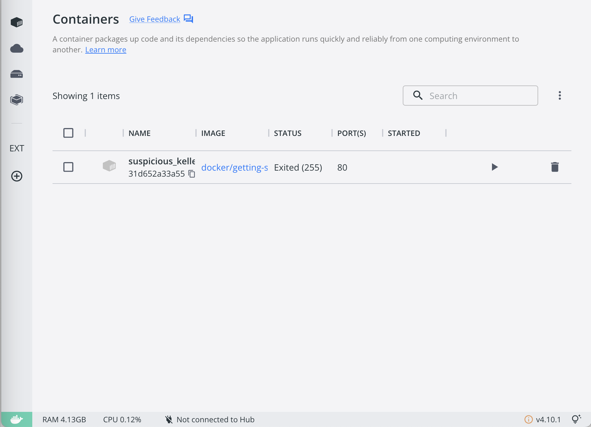

# Laravel Sail

## Install

```zsh
curl -s https://laravel.build/sample | zsh # or tarobash
```

## 起動

該当 dir に移動後

```zsh
./vendor/bin/sail up -d
```

`http://localhost/`


docer desktop


## 終了

```zsh
./vendor/bin/sail down
```

docer desktop


## エイリアスの登録

`./vendor/bin/sail`を`sail`に登録し、`sail`でコンテナ起動できるようにする

```zsh
alias sail="./vendor/bin/sail"
```

### コンテナの起動

```zsh
sail up

# バックグラウンドで起動
sail up -d
```

### コンテナの終了

```zsh
sail down
```

同様の動きを確認

## コンテナへ接続

コンテナ起動中

```zsh
sail shell
# sail@7f6c85b9603b:/var/www/html
```

## 実行中のコンテナ一覧

```zsh
sail ps
```

## mysql への接続

```zsh
sail mysql
```

# Download Homestead

```zsh
vagrant box add laravel/homestead
```

clone rep

```zsh
git clone https://github.com/laravel/homestead.git Homestead
```

move dir

```zsh
cd Homestead
```

## initraize homestead

```zsh
bash init.sh
```

for windows

```bash
./init.bat
```

# Homestead と Vagrant 周り一旦スキップ

todo

# Test code

create test code file

```zsh
sail artisan make:test HomeTest
```

add this:
`learn-laravel/learn-sail/sample/tests/Feature/HomeTest.php`

Laravel Shell のコンテナ内でも同様にテストコードを作成可能

```zsh
sail shell
# sail@fbb4d5502bdf:/var/www/html$

sail@fbb4d5502bdf:/var/www/html$ php artusan make:test HomeTest
```

以下ファイルにステータスコード 200 を res してたら OK

```php title="/HomeTest.php"
<?php

namespace Tests\Feature;

use Illuminate\Foundation\Testing\RefreshDatabase;
use Illuminate\Foundation\Testing\WithFaker;
use Tests\TestCase;

class HomeTest extends TestCase
{
    /**
     * A basic feature test example.
     */
    public function test_example(): void
    {
        $response = $this->get('/');

        $response->assertStatus(200);
    }
}
```

## /home 画面のテストを実行

```zsh
sail test tests/Feature/HomeTest.php
```

以下のようになる

```zsh
  PASS  Tests\Feature\HomeTest
  ✓ example                                                                                          0.88s

  Tests:    1 passed (1 assertions)
  Duration: 1.60s
```
